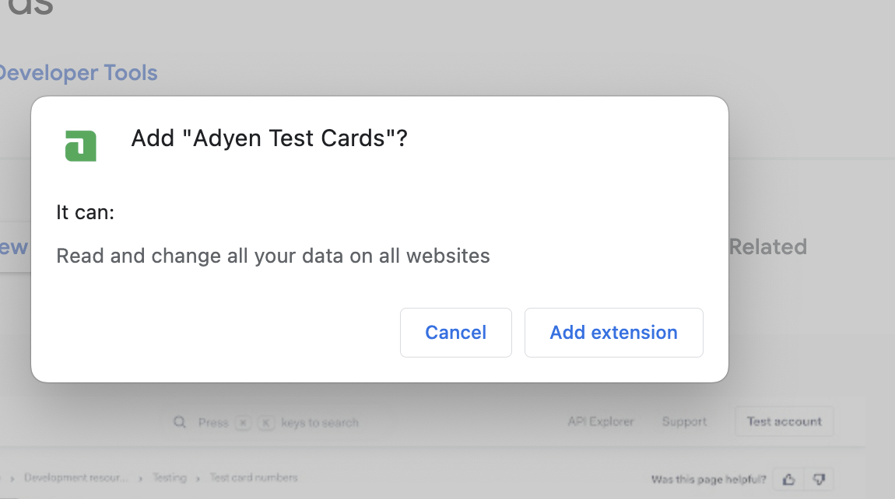

# Adyen Test Cards Chrome extension

[A Chrome extension](https://chrome.google.com/webstore/detail/adyen-test-cards/icllkfleeahmemjgoibajcmeoehkeoag) allowing to copy and prefill Adyen test card numbers with a single click.

## Adyen Test Cards

Adyen provides [test card numbers](https://docs.adyen.com/development-resources/testing/test-card-numbers) to test the Checkout integration with different payment methods and flows.

This Chrome extension brings those test card numbers directly into your browser where you can:
* copy the card number to the clipboard
* prefill the Adyen Web Drop-in with the selected card details and perform the testing quickly and easily.

### Installation

#### Installing from Chrome Web Store

1. Find the extension in the [Chrome Web Store](https://chrome.google.com/webstore/detail/adyen-test-cards/icllkfleeahmemjgoibajcmeoehkeoag)
2. Click "Add to Chrome"

The installation will warn that the extension can read and write data on all websites:

> **Note**
This is necessary as we do not know on which location your integration is hosted. The Adyen Test Cards extension copies (using Javascript) the selected card details into the Credit Card fields. No other data nor fields are read or changed. All of the code is Open-Source and there is no telemetry in this extension.
>

#### Installing from source

1. Go to the Extensions page by entering `chrome://extensions` in a new tab.
2. Enable Developer Mode.
3. Click the "Load unpacked" button and select the extension directory.

### Usage

Open the extension and choose a card number

## Contributing

We commit all our new features directly into our GitHub repository. Feel free to request or suggest new features or code changes yourself as well!

Find out more in our [contributing](https://github.com/adyen-examples/.github/blob/main/CONTRIBUTING.md) guidelines.

## License

MIT license. For more information, see the **LICENSE** file.
