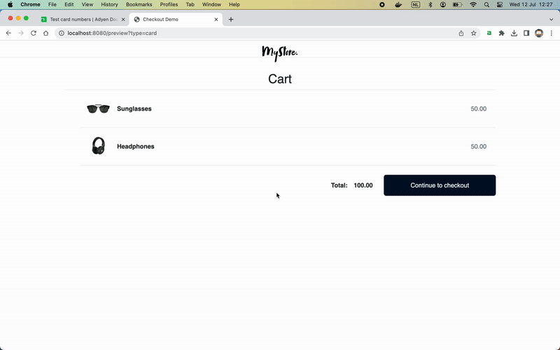

# Adyen Test Cards Chrome extension

Chrome extension with Adyen Test Cards

## Adyen Test Cards

Adyen provides [test card numbers](https://docs.adyen.com/development-resources/testing/test-card-numbers) to test the Checkout integration with different payment methods and flows.

This Chrome extension brings those test card numbers directly into your browser where you can:
* copy the card number to the clipboard
* prefill the Adyen Web Drop-in with the selected card details and perform the testing quickly and easily.

### Installation

#### Install from source

1. Go to the Extensions page by entering `chrome://extensions` in a new tab.
2. Enable Developer Mode.
3. Click the "Load unpacked" button and select the extension directory.

#### Install from Chrome Web Store

TODO

### How to use use it

Open the extension and choose a card number

## Contributing

We commit all our new features directly into our GitHub repository. Feel free to request or suggest new features or code changes yourself as well!

Find out more in our [contributing](https://github.com/adyen-examples/.github/blob/main/CONTRIBUTING.md) guidelines.

## License

MIT license. For more information, see the **LICENSE** file.
